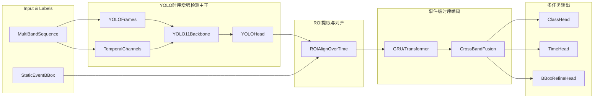

# 多模态 + YOLO + 轻量时序增强改造计划

## 一、目标与约束
- **核心目标**：
  - 提升活动事件的 **空间定位**、**爆发/束缚分类** 和 **时间信息预测** 效果。
  - 在不立即重标“逐帧 bbox 轨迹”的前提下，利用你现有的“事件级静态 bbox”标注。
- **约束与偏好**：
  - 短期 **不做复杂 tracking/轨迹算法**，但在结构和数据接口上为将来轨迹扩展预留空间。
  - 希望 YOLO 模块 **不仅仅看单帧，也能用到少量时序信息**（例如多帧堆叠/帧差通道）。

## 二、现有问题简要复盘
- **监督语义错配**：
  - 模型输出 `class_logits` 形状为 `(B, num_classes)`，训练标签为 `(B, max_activities)`，训练时通过 `expand` 广播到每个活动槽位 → 等价于“用同一个样本级预测去拟合多个活动标签”，容易出现分类塌缩（验证集全预测同一类）。
  - 参见：[training/trainer.py](e:\ChenMeng\Graduate_Student\Experiment_and_Data\Flare_with_without_CME_forecast\training\trainer.py) 中 `compute_loss` 的分类部分。
- **定位头过于简单**：
  - 目前 bbox 头基于全局池化特征直接线性回归 `(B, D) → (B, max_activities*4)`，缺少检测器常见的 anchor/grid 结构与匹配策略，对复杂空间形态和多活动很不友好。
  - 参见：[models/multimodal_transformer.py](e:\ChenMeng\Graduate_Student\Experiment_and_Data\Flare_with_without_CME_forecast\models\multimodal_transformer.py) 中 `bbox_predictor`。
- **评估与后处理存在语义混乱风险**：
  - 部分文件中 class1/class2 的注释与使用不完全一致，可能放大“预测都不对”的主观感受。
  - 参见：[inference/post_processing.py](e:\ChenMeng\Graduate_Student\Experiment_and_Data\Flare_with_without_CME_forecast\inference\post_processing.py)。

## 三、总体架构（路线3：YOLO + 静态 bbox + 事件级时序 + 预留轨迹接口）

- **关键点**：
  - YOLO 部分 **不是只看单帧**，而是允许：
    - 使用 **多帧堆叠**（如最近 3 帧或 5 帧）作为输入通道；
    - 或添加 **时序差分/光流通道**（如 `I_t - I_{t-1}` 汇总到额外通道），在 YOLO backbone 里就引入少量时序信息。
  - 时序编码模块聚焦在 **“围绕静态 bbox 区域的多帧变化”**，输出事件级向量用于分类/时间预测。
  - 整个 pipeline 在数据结构上支持未来的 **多 track/多 bbox 序列**，当前实现只使用“单事件主轨”（track_id=0）。

## 四、阶段划分与具体任务

### 阶段1：修正当前监督与指标（不引入 YOLO，打地基）

- **1.1 统一分类语义**
  - 在 Dataset 层，将窗口内的多个活动标签整合为 **事件级主标签**：
    - 若窗口内存在 eruptive → 记为 1；
    - 否则若存在 confined → 记为 2；
    - 否则为 0（无事件）。
  - 在训练器中，把分类损失改为基于 `(B,)` 标签的 **样本级 CrossEntropyLoss**，不再将 logits 广播到 `max_activities`。
- **1.2 评估指标对齐**
  - 训练/验证时，分类指标都按事件级主标签统计，避免一个事件在多个 activity slot 被重复计数。
- **1.3 统一类别定义与注释**
  - 在模型、trainer、后处理、可视化中统一常量约定：`0=无事件, 1=爆发(eruptive/CME), 2=束缚(confined)`。
  - 明确写入注释和 README，防止混用。

> 作用：在不改数据集的情况下，先解决“监督错配导致的塌缩”和评估偏差，为后续 YOLO 集成提供清晰的基线。

### 阶段2：设计 YOLO 轻量时序输入与静态 bbox 训练策略

- **2.1 YOLO 输入策略（回答你关于时序输入的问题）**
  - 不是只允许单帧，可以设计为：
    - **多帧堆叠输入**：
      - 选取窗口中的 `k` 帧（例如 `t-2,t-1,t` 或 `t-1,t,t+1`），在通道维堆叠形成 `C*k` 通道输入；
      - 对 YOLO 来说，相当于“彩色图像扩展到更多通道”，可以感知短时变化。
    - **帧差/时序统计通道**（推荐与你当前标注最匹配的方式）：
      - 对一个主帧 `I_t`，额外构造：
        - `ΔI_t = I_t - I_{t-1}`（或与 `t-2` 的差分）；
        - ROI/全图内的亮度均值、方差、最大值等时序统计；
      - 将这些差分/统计归一化后拼接到输入通道上，YOLO 在 backbone 里就能利用“近期变化程度”来决定 bbox 位置和大小。
- **2.2 静态 bbox 的 YOLO 训练方式**
  - 采用你当前的“事件级静态框”作为训练 GT：
    - 每个训练样本（时间窗口）选用一个 **参考帧**（如窗口最后一帧或峰值附近帧）作为 YOLO 的空间监督帧；
    - 在该帧上用你的静态 bbox 作为唯一 GT 框，类别可以是：
      - 单类 “activity-region”。
  - 这样 YOLO 学到的是“在这一类事件典型发展阶段下，这个区域应当被框出来”，再加上少量时序通道，可以略微感知演化趋势。

> 结果：YOLO 模块已经“看见”了短期时序变化，但不会要求你为每一帧都重新标注 bbox。

### 阶段3：事件级 ROI 序列构建与时序编码

- **3.1 ROI 提取（当前实现：单轨迹）**
  - 对每个样本：
    - 使用 YOLO 在参考帧上预测出的 bbox（或直接使用你的静态 bbox），在整个时间窗口的每一帧上裁剪相同位置的 ROI patch；
    - 对每个 ROI patch 通过一个轻量 CNN 提特征，得到 `(T, D)` 的时间序列；
    - 多模态情况下，在各波段裁剪同一 ROI，再做简单融合（拼接 + 线性层 / attention）。
- **3.2 时序编码**
  - 使用 GRU 或 Transformer 将 `(T, D)` 编码成：
    - 事件级向量（时间维池化）
    - 可选：保留所有时间步表示，为未来轨迹扩展准备更细粒度信息。
- **3.3 多任务头**
  - 分类头：事件级 eruptive/ confined 分类；
  - 时间预测头：输出 `[start_offset_hours, peak_offset_hours, duration_hours]`，并保持 softplus + 物理约束一致性；
  - bbox 细化头（可选）：在参考帧上对 YOLO 框做 offset 回归，以缓解 YOLO 误差。

> 整个阶段的损失与评估都基于“事件级”，与阶段1保持一致。

### 阶段4：预留多轨迹/复杂时序扩展接口（暂不启用）

- **4.1 通用数据结构**
  - 将事件表示为：
    - `event_id`
    - `tracks: List[Track]`，其中每个 `Track` 至少包含：
      - `track_id`
      - `bbox_t`（当前实现为长度为1的常数 bbox，未来可以是随时间变化的列表）；
      - `features_t`（时序特征序列）。
    - 当前实现只使用 `track_id=0` 的单 track，行为等价于“单事件主轨”。
- **4.2 训练与推理接口**
  - 在模型的 forward 输出中保留 `tracks` 这一层级；
  - 推理后处理与可视化输出中，也将结果组织成：
    - `event_id, track_id, class, processed_time, bbox / bbox_sequence, confidence`。

> 这样将来你想补标“多事件 + 随时间变化的 bbox”或接入 tracking 算法时，可以在不推翻整体框架的前提下扩展。

## 五、验收指标与对比实验建议

- **阶段1 验收**：
  - 验证集不再长期出现“macro_precision/recall/f1 ≈ 0”且预测集中在单一类别。
  - 日志中 `val_pred_class_counts` 分布与 `val_target_class_counts` 更接近。
- **阶段2–3 验收**：
  - 定位：在有限人工检视样本上，ROI 区域与实际耀斑区域重合度显著优于当前线性回归框。
  - 分类：比较“旧模型 vs 新 YOLO+ROI+时序模型”在 macro-F1 和爆发类召回上的提升。
  - 时间：比较 start/peak/duration 的 MAE 与命中率，观察是否明显好于现有方案。
- **消融建议**：
  - 单帧 YOLO vs 多帧堆叠 vs 单帧 + 差分通道；
  - 有/无 ROI 时序编码；
  - 有/无 bbox 细化头。

## 六、小结：关于 YOLO 是否能用时序信息

- **可以**，而且推荐在你当前标注条件下使用“**多帧/差分作为 YOLO 输入的额外通道**”这种轻量方案：
  - 不强迫你重标逐帧 bbox；
  - 又能在 YOLO 阶段提前利用短期演化信息，帮助更稳定地锁定活动区域。
- 完整轨迹 tracking 和随时间变化 bbox，可以等你未来优化数据集时再升级，目前的设计已经为这一步留好了接口。