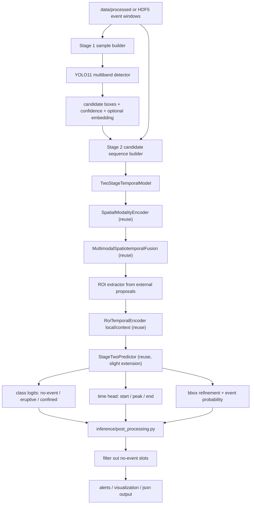

# YOLO11 Two-Stage Architecture In Repo

## 1. Target

目标是把后续方案落成一条清晰的仓库内流水线：

1. `Stage 1`
   使用 YOLO11 在多波段输入上检测活动区候选框，追求高召回。
2. `Stage 2`
   对每个候选框裁剪多波段时序 ROI，做分类：
   `no-event / eruptive / confined`
3. `Stage 3`
   在分类特征上扩展时间预测头，输出：
   `start / peak / end`

其中 `no-event` 的定位要严格限定为：

- 训练时的内部负类
- proposal 筛除和误检抑制用的中间类别
- 不能作为最终事件结果输出到测试集结果、告警结果或正式推理结果中

也就是说，最终导出的事件列表里只允许保留：

- `eruptive`
- `confined`

这里建议采用“外部 YOLO proposal + 现有时序模型复用”的方式，而不是把 YOLO11 强行塞进当前 `MultimodalTransformer` 内部。

---

## 2. Recommended Landing Strategy

核心原则：

- 不把“少推翻”当成目标，把效果、可验证性和后续可扩展性放在更前面。
- 可以保留当前 `data/`, `training/`, `inference/` 的主干组织方式，但模型层允许做中等甚至较大重构。
- YOLO11 可以作为独立的 `proposal generator`，也允许后续被更强的 region proposal 方案替换。
- `ProposalDecoder` 不必被强行保留为主路径，它更适合作为 baseline 或对照组。
- `no-event` 只作为中间判别类，不进入最终事件输出。

这样做的原因：

- 你已经有现成的多模态时序数据组织和 `bbox/time_features/activity_mask` 接口。
- 当前模型已经有 `RoiTemporalEncoder` 和 `StageTwoPredictor`，这些适合承接外部 proposal。
- 如果前一版 backbone 或 proposal 机制效果一般，这种拆法更容易局部替换而不影响全链路。
- 如果后面要比较“级联”与“联合多任务”，这个结构更容易做 ablation。

### 2.1 Two Refactor Levels

建议从一开始就把路线分成两档，而不是默认保守复用。

#### Route A: Moderate Refactor

- 复用当前时空编码主干
- 用外部 YOLO11 替换内部 proposal 主路径
- 保留当前 `StageTwoPredictor`，只做输入适配和时间头扩展

适合：

- 先快速验证两阶段方案是否有效
- 尽快得到第一版可比较实验结果

#### Route B: Aggressive Refactor

- 只保留数据层和训练框架
- 重写 stage2 主模型
- 把当前 `MultimodalTransformer` 仅保留为 baseline

适合：

- 当前 proposal 质量差
- 当前 fusion/ROI 机制限制明显
- 想系统比较 `ConvLSTM / ViT / Video Swin / TimeSformer` 等时序骨干

如果后面实验发现当前时空主干性能上限明显不足，建议直接切到 `Route B`，不要因为历史代码而绑住方案。

---

## 3. In-Repo Architecture Graph



---

## 4. Proposed Repository Split

建议按下面的方式落地，而不是把所有逻辑继续堆进一个文件：

```text
configs/
  yolo11_data.yaml
  yolo11_train.yaml
  temporal_stage2_config.yaml
  pipeline_config.yaml

data/
  yolo_dataset.py
  candidate_dataset.py
  candidate_sampler.py
  proposal_io.py

models/
  multimodal_transformer.py              # 继续保留，复用内部模块
  two_stage_temporal_model.py            # 新增，接收外部 proposals
  roi_extractors.py                      # 新增，proposal -> local/context ROI
  proposal_feature_adapter.py            # 新增，可选
  yolo11_detector_wrapper.py             # 新增，封装 ultralytics YOLO

training/
  trainer.py                             # 小改，支持 external proposals
  yolo_trainer.py                        # 新增，管理 detector 训练
  stage2_trainer.py                      # 新增或由 trainer.py 扩展
  losses.py                              # 新增，可选，拆分分类/时间/bbox loss

inference/
  predictor.py                           # 小改，支持 stage1 + stage2 pipeline
  pipeline_predictor.py                  # 新增，串联 detector 与 temporal model
  proposal_post_processing.py            # 新增，可选

scripts/
  train_yolo11.py
  train_temporal_stage2.py
  run_two_stage_inference.py
```

---

## 5. What To Reuse Directly

下面这些文件和类建议直接复用，不要重写。

### 5.1 Data Layer

- `data/dataset.py`
  已经能输出：
  `label`, `bbox`, `activity_mask`, `time_features`
- `data/data_loader.py`
  继续负责 HDF5 -> window dataset -> dataloader
- `data/hdf5_reader.py`
  继续作为底层读入接口

### 5.2 Model Layer

来自 `models/multimodal_transformer.py` 的可复用模块：

- `SpatialModalityEncoder`
- `CrossModalAttention`
- `LearnablePositionalEncoding`
- `MultimodalSpatiotemporalFusion`
- `RoiTemporalEncoder`
- `StageTwoPredictor`

说明：

- `ProposalDecoder` 不再作为主 proposal 来源。
- 它可以保留，用于和“纯内部 proposal 模型”做对照实验。

### 5.3 Training / Inference Layer

- `training/trainer.py`
  继续保留其训练循环、scheduler、checkpoint、metrics 主框架。
- `training/checkpoint_manager.py`
- `training/early_stopping.py`
- `training/metrics_tracker.py`
- `inference/post_processing.py`
- `inference/predictor.py`
  可以作为单模型推理器的基类思路继续使用。

### 5.4 Utility Layer

- `utils/config_utils.py`
- `utils/active_region_utils.py`
- `utils/time_utils.py`
- `utils/metrics_calculation.py`
- `utils/visualization.py`

---

## 6. New Files And Classes To Add

下面是最推荐的一版新增清单。

### 6.1 Stage 1: YOLO11 Detector

#### File

`models/yolo11_detector_wrapper.py`

#### New Classes

`YOLO11ActiveRegionDetector`

- 职责：
  封装 `ultralytics.YOLO` 的加载、训练、推理。
- 输入：
  单帧多波段组合图像。
- 输出：
  `boxes`, `scores`, `class_ids`, `optional_features`

`MultibandYOLOInputComposer`

- 职责：
  把 `magnetogram / euv_94 / euv_171 / euv_193 / halpha` 组合成 YOLO11 可接收的输入。
- 推荐先做两种模式：
  `pseudo_rgb`
  `five_channel_tensor`
- 建议先从 `pseudo_rgb` 起步，便于快速跑通。

#### File

`data/yolo_dataset.py`

#### New Classes

`YOLOActiveRegionDataset`

- 职责：
  从 `data/processed/*/bboxes.json` 和多波段图像目录构建 YOLO 训练样本。
- 每个样本以“某个时间点的一组多波段图像”为单位。
- 标签目标：
  活动区候选框，而不是 flare bright kernel。

`YOLOLabelExporter`

- 职责：
  将当前事件标注导出成 YOLO 所需的
  `images/ labels/ data.yaml`
  结构。

### 6.2 Stage 2: External-Proposal Temporal Model

#### File

`models/two_stage_temporal_model.py`

#### New Classes

`TwoStageTemporalModel`

- 职责：
  接收外部 proposals，复用现有多模态时空编码器完成分类、时间预测和 bbox refine。
- 输入：
  `multimodal sequence + proposal boxes + proposal scores`
- 输出：
  `class_logits`, `class_probs`, `time_pred`, `bbox_pred`, `event_prob`
- 约束：
  `class_id == no-event` 的 slot 只能参与内部损失和抑制，不能进入最终事件输出

`ExternalProposalAdapter`

- 职责：
  把 YOLO11 输出格式统一为时序模型内部使用的 proposal 格式。
- 统一字段：
  `proposal_boxes`, `proposal_scores`, `proposal_source`, `frame_index`

#### File

`models/roi_extractors.py`

#### New Classes

`ExternalProposalRoiExtractor`

- 职责：
  基于外部 bbox，从融合后的 `fused_maps` 中裁剪：
  `local ROI`
  `context ROI`
- 它本质上替代当前内部 `proposal -> ROI` 的衔接部分。

`ContextBoxExpander`

- 职责：
  依据 `context_scale` 生成上下文框。

#### File

`models/proposal_feature_adapter.py`

#### New Classes

`ProposalFeatureProjector`

- 职责：
  将 YOLO 的
  `confidence`, `class logits`, `optional embedding`
  投影到 `StageTwoPredictor` 需要的 `proposal_feature` 空间。
- 如果 YOLO 暂时拿不到 embedding，可先仅使用：
  `score + geometry`

### 6.3 Candidate Sequence Building

#### File

`data/candidate_dataset.py`

#### New Classes

`CandidateSequenceDataset`

- 职责：
  读取 HDF5 的多波段窗口数据，并绑定对应窗口里的 proposal。
- 每条样本不是“整事件”，而是：
  `window + candidate slots`

`CandidateTargetBuilder`

- 职责：
  负责把真实 `bbox/label/time_features` 与 proposal 做匹配，生成 stage2 监督信号。

#### File

`data/candidate_sampler.py`

#### New Classes

`ProposalWindowMatcher`

- 职责：
  把 YOLO 在某一帧或若干帧上的检测结果，对齐到当前时序窗口。

`CandidateSlotAssigner`

- 职责：
  根据 IoU 或 region_id 把 proposal 分配到固定 slot。

#### File

`data/proposal_io.py`

#### New Classes

`ProposalSerializer`

- 职责：
  保存和读取 stage1 检测结果，格式建议是
  `jsonl / parquet / pt`

`ProposalCacheManager`

- 职责：
  支持离线缓存 detector 输出，避免每次训练 stage2 都重新跑 YOLO。

### 6.4 Training And Pipeline

#### File

`training/yolo_trainer.py`

#### New Classes

`YOLO11Trainer`

- 职责：
  管理 detector 训练、验证、导出 best weights。

#### File

`training/stage2_trainer.py`

#### New Classes

`Stage2TemporalTrainer`

- 职责：
  针对 `TwoStageTemporalModel` 封装训练过程。
- 如果你想尽量少加文件，也可以先把它并入现有 `training/trainer.py`。

#### File

`inference/pipeline_predictor.py`

#### New Classes

`TwoStagePipelinePredictor`

- 职责：
  串联：
  `YOLO11 detector -> proposal adapter -> temporal model -> post processor`

`DetectionTemporalMerger`

- 职责：
  把 detector 结果与 stage2 分类/时间结果合并成最终事件输出。

`OutputEventFilter`

- 职责：
  在测试集评估和正式推理导出前，删除所有 `no-event` slot
- 只保留：
  `eruptive`
  `confined`
- 即使某个 slot 有 bbox、有高置信度 proposal，只要分类最终为 `no-event`，也不得输出

---

## 7. Existing Files That Need Small Changes

这里建议“小改”，不要大改。

### `models/multimodal_transformer.py`

建议处理方式：

- 保留当前实现。
- 把其中可复用类继续留在这里。
- 新增少量导出接口即可，不建议把 YOLO11 逻辑混进这个文件。

可改动点：

- 把 ROI 提取相关逻辑适当下沉为公用函数。
- 让 `StageTwoPredictor` 支持“外部 proposal feature 可选输入”。
- 保留 `ProposalDecoder` 仅用于 baseline。

### `training/trainer.py`

可改动点：

- 允许 batch 里附带：
  `proposal_boxes`
  `proposal_scores`
  `proposal_metadata`
- 增加对 stage2 模式的 loss 路由：
  `classification`
  `event_prob`
  `bbox`
  `time`
- 兼容“无时间头”和“有时间头”两种运行模式。

### `inference/predictor.py`

可改动点：

- 抽出一层通用 `BasePredictor` 风格的流程。
- 保留当前单模型推理器。
- 新增外部 pipeline 时，让 `pipeline_predictor.py` 复用其后处理逻辑。
- 明确把 `class_id == 0` 视为中间态，不写入最终 detections 列表。

### `inference/post_processing.py`

可改动点：

- 支持来自 detector 的原始 proposal 信息透传。
- 支持输出：
  `stage1_bbox`
  `refined_bbox`
  `temporal_class`
  `time_prediction`
- 增加强制过滤规则：
  `no-event` 不允许进入最终输出结果
- 测试集评估若需要保留 `no-event`，也只能存在于内部统计张量，不能存在于导出的事件清单

### `configs/model_config.yaml`

建议新增配置块：

```yaml
model:
  proposal_source: "external_yolo"   # internal, external_yolo
  use_external_proposals: true
  external_proposal_feature_dim: 16
```

### `configs/inference_config.yaml`

建议新增配置块：

```yaml
pipeline:
  enable_stage1_detector: true
  detector_weights: "runs/yolo11/best.pt"
  proposal_cache_path: "outputs/proposals"
  proposal_frame_policy: "last_frame"   # last_frame, key_frame, all_frames
```

---

## 8. Training And Inference Flow In This Repo

### 8.1 Detector Training Flow

```text
data/processed + bbox annotations
  -> YOLOActiveRegionDataset
  -> YOLOLabelExporter
  -> YOLO11Trainer
  -> best detector weights
```

### 8.2 Stage2 Training Flow

```text
HDF5 event windows
  + offline YOLO proposals
  -> CandidateSequenceDataset
  -> TwoStageTemporalModel
  -> Stage2TemporalTrainer
  -> classification / time / bbox / event_prob heads
```

### 8.3 Inference Flow

```text
multiband time window
  -> YOLO11ActiveRegionDetector
  -> ExternalProposalAdapter
  -> TwoStageTemporalModel
  -> PostProcessor
  -> OutputEventFilter
  -> json + visualization + alerts
```

---

## 9. Minimum Viable Implementation Order

建议按这个顺序做，风险最低。

### Phase 1

先跑通 detector：

- 新增 `data/yolo_dataset.py`
- 新增 `models/yolo11_detector_wrapper.py`
- 新增 `scripts/train_yolo11.py`

目标：

- 先把活动区候选框稳定检出。

### Phase 2

把外部 proposals 接到当前时序模型：

- 新增 `models/two_stage_temporal_model.py`
- 新增 `models/roi_extractors.py`
- 新增 `data/candidate_dataset.py`

目标：

- 先做分类，不开时间头。

### Phase 3

再开时间预测：

- 扩展 `StageTwoPredictor`
- 在 `training/trainer.py` 或 `training/stage2_trainer.py` 中接入时间 loss
- 在 `inference/post_processing.py` 中输出 `start/peak/end`

目标：

- 比较：
  `classification only`
  `classification + time head`

### Phase 4

最后做类别条件时间预测：

- 在 `StageTwoPredictor` 中加入
  `class-conditioned time head`
  或 `mixture-of-experts time head`

目标：

- 专门验证 eruptive 与 confined 持续时间差异是否带来增益。

---

## 10. Recommended First Implementation Choice

如果只做一条最稳的落地路径，推荐：

`YOLO11ActiveRegionDetector`
-> `ProposalSerializer`
-> `CandidateSequenceDataset`
-> `TwoStageTemporalModel`
-> `StageTwoPipelinePredictor`

也就是：

- `Stage 1` 独立训练
- `Stage 2` 独立训练
- 推理时再级联

这条路线最适合你当前仓库，因为它：

- 复用现有模型最多
- 对现有训练器破坏最小
- 最方便做后续 ablation
- 最容易扩展到时间预测

---

## 11. Concrete Reuse Map

### Keep As-Is

- `data/hdf5_reader.py`
- `data/dataset.py`
- `data/data_loader.py`
- `training/checkpoint_manager.py`
- `training/early_stopping.py`
- `training/metrics_tracker.py`
- `utils/config_utils.py`
- `utils/metrics_calculation.py`

### Reuse Core Classes

- `models/multimodal_transformer.py::SpatialModalityEncoder`
- `models/multimodal_transformer.py::MultimodalSpatiotemporalFusion`
- `models/multimodal_transformer.py::RoiTemporalEncoder`
- `models/multimodal_transformer.py::StageTwoPredictor`

### Keep For Baseline Comparison

- `models/multimodal_transformer.py::ProposalDecoder`

### New Main Entry Points

- `scripts/train_yolo11.py`
- `scripts/train_temporal_stage2.py`
- `scripts/run_two_stage_inference.py`

---

## 12. Summary

这版仓库内落地方式不是“重写一个新系统”，而是：

- 用 YOLO11 替换当前内部 proposal 生成的主入口
- 复用你已经写好的多模态时空编码和 ROI 级预测部分
- 新增一层外部 proposal 适配和候选区时序数据组织

但如果实验结果表明当前时空主干本身已经成为瓶颈，也可以把它升级成：

- 保留数据层
- 保留训练/推理框架
- 把 `MultimodalTransformer` 降级成 baseline
- 用新 stage2 主模型直接替换

另外有一条必须固定下来的输出规则：

- `no-event` 可以训练
- `no-event` 可以参与 proposal 抑制
- `no-event` 不能出现在测试集最终事件输出中

最关键的新类只有 5 个：

1. `YOLO11ActiveRegionDetector`
2. `YOLOActiveRegionDataset`
3. `CandidateSequenceDataset`
4. `ExternalProposalRoiExtractor`
5. `TwoStageTemporalModel`

如果这 5 个先落好，后面分类、时间预测、级联对比实验都会顺很多。
